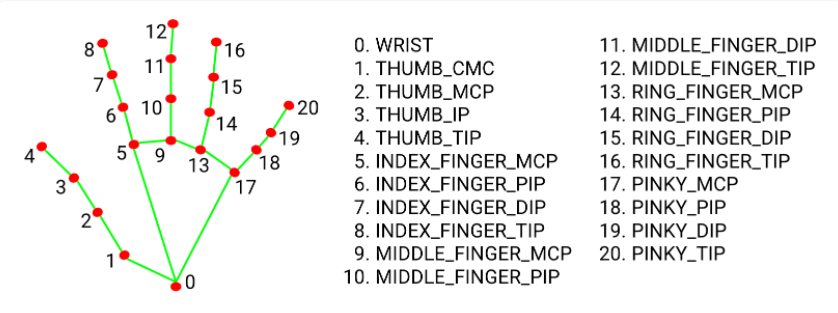

# Hand volume controller

## Hand landmarks we are identifying and using (mediapipe)



We are going to use value number ```4``` (thumb tip) and ```8``` (index finger tip) as the volume controllers

## Steps to run program

1. Open cmd and ```cd``` into the directory you have cloned this project into, then type ```pip install -r requirements.txt```
2. Next type ```python handVolumeControl.py```
3. Press ```p / o``` on your keyboard to show/not show frames per second. Press ```x``` to close the program.
4. Keep your hand about 10 inches from the webcam, and have the palm of your hand facing clearly towards the webcam. Move your index and thumb fingers to control the volume and you can see the current volume on the volume bar which will display. To completely mute the volume when needed you just need to keep your thumb and index finger pinched for about 4 seconds, this will fully mute your sound. To un-mute just show your other hand to the camera.
